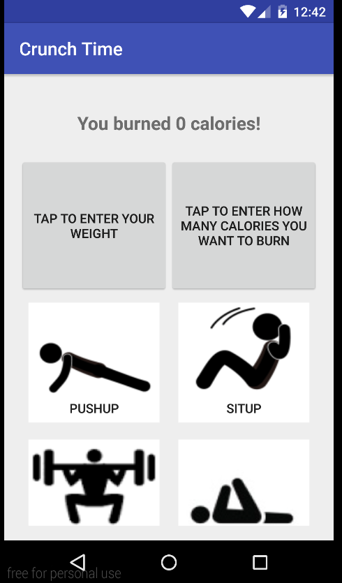

# PROG 01: Crunch Time

My Crunch Time app allows the user to calculate how many calories they have burned based off of how much they exercised. The main screen shows images of different types of exercises that the user can click on to input how many reps or minutes of an exercise they did. Once a user clicks on an exercise, a dialog box appears for the user to enter in how much they did. After the user enters it, the app displays how many calories they burned at the top of the app, and it also shows, under each image, the equivalent amount of exercise for every other exercise to burn the same amount of calories. The user can click on any of the exercises at any time. My app gives the user the option to input how many calories they want to burn. It then displays the reps or minutes needed for every exercise to burn that amount of calories. My app also gives the user the option to enter their own weight for a more accurate measurement of calories burned and reps or minutes needed.

## Authors

Joshua Meeker ([jrmeeker@berkeley.edu](mailto:jrmeeker@berkeley.edu))

## Demo Video

See [Crunch Time Tutorial] (https://youtu.be/epBHgruMisk)

## Screenshots

## Acknowledgments

* Hat tip to anyone who's code was used
* Any other support

*Feel free to enhance your README. For Markdown syntax, see [the GitHub Guides](https://guides.github.com/features/mastering-markdown/). Remove this line in your submission.*
